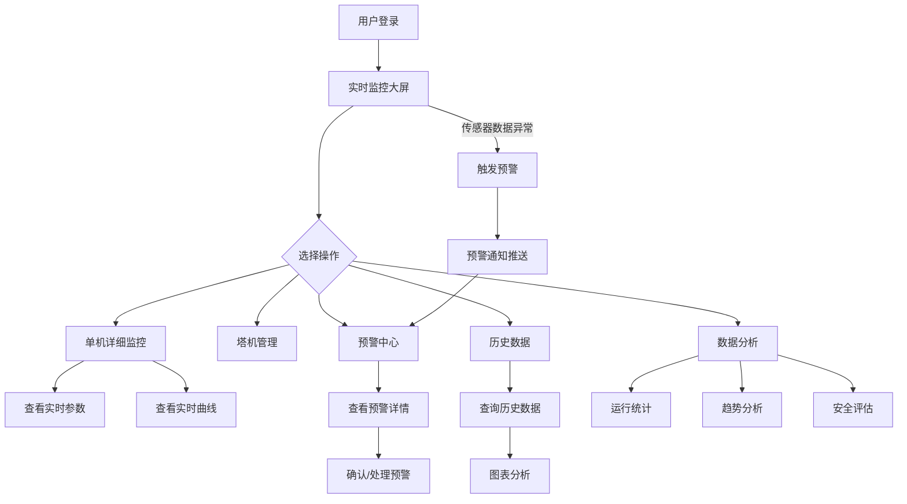

## 1. 产品概述

智慧工地塔机数据监测系统是一款面向建筑施工领域的物联网监控平台，旨在通过实时采集塔机传感器数据（起重量、力矩、幅度、高度、回转角度、风速等），实现对塔机运行状态的全天候监控、智能异常预警与历史数据分析，有效预防塔机安全事故，提升施工现场安全管理水平。

- **目标用户**：施工项目经理、安全管理人员、设备运维工程师、塔机操作员
- **核心价值**：降低塔机作业风险、减少人工巡检成本、提供数据驱动的安全决策依据

## 2. 核心功能

### 2.1 用户角色

| 角色 | 注册方式 | 核心权限 |
|------|----------|----------|
| 系统管理员 | 管理员分配 | 全部功能访问、用户管理、系统配置 |
| 安全管理员 | 管理员分配 | 监控查看、预警处理、历史数据查询、报表导出 |
| 设备运维员 | 管理员分配 | 设备管理、数据查看、预警确认 |

### 2.2 功能模块

1. **实时监控大屏**：多塔机全局状态地图、单机详细监控面板、实时数据仪表盘、运行参数曲线、视频监控占位
2. **塔机管理**：塔机设备列表、设备详情、传感器状态管理、维保记录
3. **历史数据**：多维度历史数据查询、时序数据图表、数据导出、对比分析
4. **预警中心**：实时预警通知、预警规则配置、预警历史记录、预警级别管理
5. **数据分析**：运行统计报表、趋势分析、安全评估报告、设备健康度分析

### 2.3 页面详情

| 页面名称 | 模块名称 | 功能描述 |
|----------|----------|----------|
| 实时监控大屏 | 全局概览 | 展示工地所有塔机位置分布、整体运行状态统计（在线/离线/报警） |
| 实时监控大屏 | 单机监控面板 | 显示选中塔机的实时参数：起重量、力矩、幅度、高度、回转角度、风速 |
| 实时监控大屏 | 实时曲线 | 各参数实时折线图，最近5分钟数据滚动更新 |
| 实时监控大屏 | 预警信息流 | 底部滚动显示最新预警事件，按级别颜色区分 |
| 塔机管理 | 设备列表 | 塔机列表卡片/表格，显示设备编号、型号、状态、安装位置 |
| 塔机管理 | 设备详情 | 设备基本信息、传感器配置、维保记录、运行统计 |
| 历史数据 | 数据查询 | 按设备、时间范围、参数类型查询历史数据 |
| 历史数据 | 数据图表 | 时序折线图、柱状图展示历史趋势，支持缩放与区间选择 |
| 预警中心 | 实时预警 | 当前活跃预警列表，按级别排序，支持确认和处理 |
| 预警中心 | 预警规则 | 配置各参数的预警阈值和报警级别 |
| 预警中心 | 预警历史 | 历史预警记录查询，支持按时间、级别、设备筛选 |
| 数据分析 | 运行统计 | 设备运行时长、工作频次、负载率统计 |
| 数据分析 | 趋势分析 | 参数变化趋势、周期性规律分析、异常模式识别 |
| 数据分析 | 安全评估 | 综合安全评分、风险因素分析、改进建议 |

## 3. 核心流程

用户登录系统后进入实时监控大屏，默认展示工地所有塔机的全局状态。点击某台塔机后进入单机详细监控面板，实时查看各项运行参数和曲线。当传感器数据超过预设阈值时，系统自动触发预警，预警信息实时推送到监控大屏和预警中心。安全管理人员可在预警中心查看和处理预警事件，在历史数据页面查询和分析过往数据，在数据分析页面生成统计报表和评估报告。

## 4. 用户界面设计

### 4.1 设计风格

- **主色调**：深蓝灰色(#0B1120)背景 + 青蓝色(#00D4FF)主强调色 + 橙红色(#FF6B35)预警色
- **辅助色**：深灰(#1A2332)卡片背景、中灰(#2A3A4E)边框、绿色(#00E676)正常状态、黄色(#FFD600)注意状态
- **按钮风格**：圆角微渐变按钮，hover时发光效果
- **字体**：标题使用 DIN Alternate / Rajdhani（工业仪表风格），正文使用 Noto Sans SC
- **布局风格**：左侧导航栏 + 顶部状态栏 + 主内容区，监控大屏采用全屏暗色沉浸式布局
- **图标风格**：线性描边图标（lucide-react），科技感强
- **动效**：数据数字滚动动画、曲线平滑绘制、预警闪烁脉冲、卡片hover微浮起

### 4.2 页面设计概览

| 页面名称 | 模块名称 | UI要素 |
|----------|----------|--------|
| 实时监控大屏 | 全局概览 | 深色背景地图区域，塔机图标标注位置，右侧统计卡片（在线数/离线数/报警数），顶部状态栏 |
| 实时监控大屏 | 单机监控面板 | 中央大仪表盘（力矩百分比圆环），周围环绕6个参数卡片（起重量/幅度/高度/回转/风速/倾角），底部实时曲线 |
| 实时监控大屏 | 预警信息流 | 底部横向滚动条，红色/橙色/黄色预警卡片，脉冲动画 |
| 塔机管理 | 设备列表 | 顶部筛选栏，卡片式列表，每卡片含设备缩略图、状态指示灯、关键参数 |
| 历史数据 | 数据查询 | 左侧筛选面板（设备/时间/参数），右侧大图表区域，底部数据表格 |
| 预警中心 | 实时预警 | 左侧预警列表（按级别分组），右侧预警详情面板 |
| 数据分析 | 运行统计 | 统计卡片组+图表组合布局，支持切换时间范围 |

### 4.3 响应式设计

- 桌面端优先（1920x1080最佳），监控大屏适配4K大屏
- 平板端自适应布局，卡片网格从4列变2列
- 移动端简化视图，保留核心监控和预警功能

### 4.4 3D场景指导

本系统不含3D场景，采用2D数据可视化方式展示塔机状态，使用Canvas/SVG绘制仪表盘和图表。
