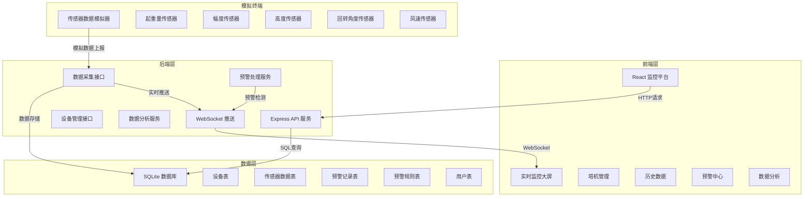
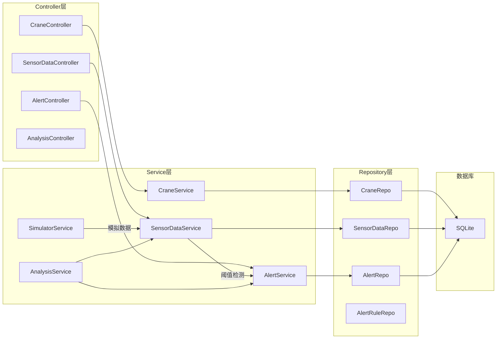
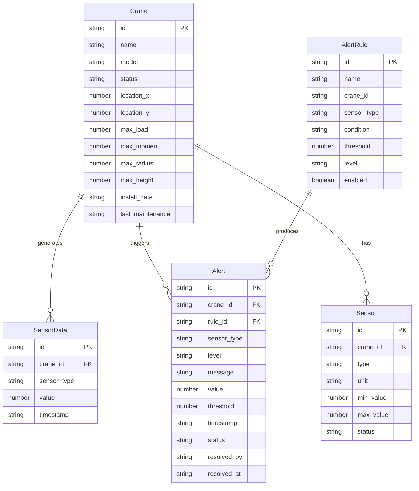

## 1. 架构设计



## 2. 技术说明

- **前端**：React@18 + TypeScript + TailwindCSS@3 + Vite
- **初始化工具**：vite-init（react-express-ts模板）
- **状态管理**：Zustand
- **图表库**：Recharts
- **后端**：Express@4 + TypeScript（ESM格式）
- **数据库**：SQLite（better-sqlite3）
- **实时通信**：WebSocket（ws库）
- **数据模拟**：后端定时任务模拟传感器数据上报

## 3. 路由定义

| 路由 | 用途 |
|------|------|
| / | 实时监控大屏 - 全局概览和单机详细监控 |
| /cranes | 塔机管理 - 设备列表和详情 |
| /cranes/:id | 塔机详情 - 单台塔机详细信息 |
| /history | 历史数据 - 多维度历史数据查询 |
| /alerts | 预警中心 - 实时预警和预警规则 |
| /analysis | 数据分析 - 运行统计和趋势分析 |

## 4. API定义

### 4.1 设备管理接口

```typescript
interface Crane {
  id: string
  name: string
  model: string
  status: "online" | "offline" | "alarm"
  location: { x: number; y: number }
  maxLoad: number
  maxMoment: number
  maxRadius: number
  maxHeight: number
  installDate: string
  lastMaintenance: string
  sensors: Sensor[]
}

interface Sensor {
  id: string
  craneId: string
  type: "load" | "moment" | "radius" | "height" | "rotation" | "wind"
  unit: string
  minValue: number
  maxValue: number
  status: "normal" | "warning" | "alarm"
}

// GET /api/cranes - 获取所有塔机列表
// GET /api/cranes/:id - 获取塔机详情
// GET /api/cranes/:id/status - 获取塔机实时状态
```

### 4.2 传感器数据接口

```typescript
interface SensorData {
  id: string
  craneId: string
  sensorType: string
  value: number
  timestamp: string
}

interface SensorDataQuery {
  craneId?: string
  sensorType?: string
  startTime: string
  endTime: string
  interval?: "1m" | "5m" | "15m" | "1h" | "1d"
}

// GET /api/sensor-data/latest/:craneId - 获取塔机最新传感器数据
// GET /api/sensor-data/history - 查询历史传感器数据
// POST /api/sensor-data - 上报传感器数据（模拟器使用）
```

### 4.3 预警接口

```typescript
interface Alert {
  id: string
  craneId: string
  craneName: string
  sensorType: string
  level: "info" | "warning" | "critical"
  message: string
  value: number
  threshold: number
  timestamp: string
  status: "active" | "acknowledged" | "resolved"
  resolvedBy?: string
  resolvedAt?: string
}

interface AlertRule {
  id: string
  name: string
  craneId: string | "all"
  sensorType: string
  condition: "gt" | "lt" | "gte" | "lte"
  threshold: number
  level: "info" | "warning" | "critical"
  enabled: boolean
}

// GET /api/alerts - 获取预警列表
// GET /api/alerts/active - 获取活跃预警
// PUT /api/alerts/:id/acknowledge - 确认预警
// PUT /api/alerts/:id/resolve - 解决预警
// GET /api/alert-rules - 获取预警规则
// POST /api/alert-rules - 创建预警规则
// PUT /api/alert-rules/:id - 更新预警规则
```

### 4.4 数据分析接口

```typescript
interface AnalysisStats {
  craneId: string
  totalRunHours: number
  avgLoad: number
  maxLoad: number
  loadRate: number
  alertCount: number
  dailyStats: DailyStat[]
}

interface DailyStat {
  date: string
  runHours: number
  avgLoad: number
  maxLoad: number
  alertCount: number
}

// GET /api/analysis/stats/:craneId - 获取塔机运行统计
// GET /api/analysis/trend/:craneId - 获取趋势分析数据
// GET /api/analysis/safety-score/:craneId - 获取安全评分
```

### 4.5 WebSocket消息格式

```typescript
interface WSMessage {
  type: "sensor_update" | "alert" | "status_change"
  payload: SensorData | Alert | { craneId: string; status: string }
}
```

## 5. 服务架构图



## 6. 数据模型

### 6.1 数据模型定义



### 6.2 数据定义语言

```sql
CREATE TABLE cranes (
  id TEXT PRIMARY KEY,
  name TEXT NOT NULL,
  model TEXT NOT NULL,
  status TEXT NOT NULL DEFAULT 'offline',
  location_x REAL NOT NULL,
  location_y REAL NOT NULL,
  max_load REAL NOT NULL,
  max_moment REAL NOT NULL,
  max_radius REAL NOT NULL,
  max_height REAL NOT NULL,
  install_date TEXT NOT NULL,
  last_maintenance TEXT NOT NULL
);

CREATE TABLE sensors (
  id TEXT PRIMARY KEY,
  crane_id TEXT NOT NULL REFERENCES cranes(id),
  type TEXT NOT NULL,
  unit TEXT NOT NULL,
  min_value REAL NOT NULL,
  max_value REAL NOT NULL,
  status TEXT NOT NULL DEFAULT 'normal'
);

CREATE TABLE sensor_data (
  id TEXT PRIMARY KEY,
  crane_id TEXT NOT NULL REFERENCES cranes(id),
  sensor_type TEXT NOT NULL,
  value REAL NOT NULL,
  timestamp TEXT NOT NULL
);

CREATE INDEX idx_sensor_data_crane_time ON sensor_data(crane_id, timestamp);
CREATE INDEX idx_sensor_data_type ON sensor_data(sensor_type);

CREATE TABLE alerts (
  id TEXT PRIMARY KEY,
  crane_id TEXT NOT NULL REFERENCES cranes(id),
  rule_id TEXT REFERENCES alert_rules(id),
  sensor_type TEXT NOT NULL,
  level TEXT NOT NULL,
  message TEXT NOT NULL,
  value REAL NOT NULL,
  threshold REAL NOT NULL,
  timestamp TEXT NOT NULL,
  status TEXT NOT NULL DEFAULT 'active',
  resolved_by TEXT,
  resolved_at TEXT
);

CREATE INDEX idx_alerts_status ON alerts(status);
CREATE INDEX idx_alerts_crane ON alerts(crane_id);
CREATE INDEX idx_alerts_timestamp ON alerts(timestamp);

CREATE TABLE alert_rules (
  id TEXT PRIMARY KEY,
  name TEXT NOT NULL,
  crane_id TEXT NOT NULL,
  sensor_type TEXT NOT NULL,
  condition TEXT NOT NULL,
  threshold REAL NOT NULL,
  level TEXT NOT NULL,
  enabled INTEGER NOT NULL DEFAULT 1
);
```
